# 🏪 Awesome Retail Workforce Management (WFM)

  

## 🌟 Curated Ecosystem of Retail Workforce Management SaaS Platforms & Open-Source Shift Scheduling Engines

  
  
  
  
  
  

*A comprehensive, developer-first directory of **Retail Workforce Management (WFM)** solutions, employee scheduling software, AI labor demand forecasting engines, frontline time and attendance systems, fair workweek compliance tools, and open-source constraint-based rostering frameworks.*

**Last updated:** September 2026

---

### 🔍 What is Retail Workforce Management?

**Retail Workforce Management (WFM)** encompasses the software platforms, algorithms, and operational processes that multi-site retailers, department stores, supermarkets, franchises, and specialty shops use to forecast foot-traffic demand, schedule hourly employees, track store attendance, automate break and overtime compliance, and optimize frontline labor expenditure.

Modern retail WFM ecosystems are divided into two main categories:
1. ☁️ **Commercial Enterprise & SMB SaaS Suites**: Full-stack cloud platforms offering end-to-end POS integrations, foot-traffic AI forecasting, automated biometric time clocks, self-service mobile shift swapping, and local Fair Workweek labor law compliance.
2. 🔓 **Open-Source Solvers & Self-Hosted Rostering Engines**: Mathematical constraint satisfaction libraries (Linear/Mixed Integer Programming, metaheuristics) and self-hosted web/desktop applications providing transparent schedule generation, duty scheduling, and on-call rotations.

---

## 📑 Table of Contents

- [📊 Market Overview & Industry Structure](#️-saashosted-platforms)
- [☁️ SaaS/Hosted Platforms](#️-saashosted-platforms)
- [🔓 Open-Source GitHub Projects](#-open-source-github-projects)
- [🏗️ Core Architectural Capabilities](#️-core-architectural-capabilities)
- [⚖️ How to Choose: SaaS vs Open-Source](#️-how-to-choose-saas-vs-open-source)
- [🤝 How to Contribute](#-how-to-contribute)
- [📈 Star History](#-star-history)
- [⚠️ Disclaimer](#️-disclaimer)

---

## ☁️ SaaS/Hosted Platforms

> 📊 **Market Overview & Industry Structure**: The global Workforce Management (WFM) software sector is estimated at **$9.5B – $11.2B in 2026** (projected to exceed **$16B by 2030** at a ~10% CAGR), with retail, restaurants, and frontline operations accounting for over 35% of total spend. The sector is **moderately fragmented**: the large enterprise tier is concentrated among legacy ERP/HCM giants (SAP, UKG, Zebra Reflexis, Dayforce) handling complex multi-country labor compliance, while the mid-market and SMB frontline tier is highly fragmented and vigorously competitive among mobile-first innovators (Deputy, Homebase, When I Work, Connecteam, 7shifts), precluding a single winner-take-all outcome.

| 🏢 Platform | 💰 Company Size (Revenue / Valuation) | 🎯 Focus / Description | 🏷️ Pricing (Starting Tier) | 🎁 Free Tier / Free Trial Limits |
| :--- | :--- | :--- | :--- | :--- |
| **[SAP SuccessFactors WFM](https://www.sap.com/)** | **~$250B+ Market Cap** (Public: NYSE: SAP; ~$35B Revenue) | Enterprise human experience management (HXM) suite with integrated workforce planning, time tracking, and scheduling. | Starts at **$6.00–$18.00 PEPM** (base Time & Attendance / WFM module; full HCM suite ranges $18.00–$38.00 PEPM) | **30-day free trial** of SAP HCM/Workforce cloud environment with pre-populated sample store shifts and guided tours (no permanent free tier) |
| **[UKG (Workforce Management / Dimensions)](https://www.ukg.com/)** | **~$22B Valuation** (Private Equity: Hellman & Friedman, Blackstone; ~$4.3B Revenue) | Enterprise workforce suite combining AI scheduling, time and attendance, labor compliance, and payroll. | Starts at **$4.00–$8.00 PEPM** (standalone WFM/time tracking module) or **$20.00–$33.00 PEPM** (UKG Ready suite; min. 100+ seats) | **30-day proof-of-concept sandbox trial** provided during enterprise technical discovery and procurement review (no permanent free tier) |
| **[Zebra Reflexis (Zebra Workcloud)](https://www.zebra.com/)** | **~$16B Market Cap** (Public: NASDAQ: ZBRA; ~$4.6B Revenue) | Enterprise store operations, task execution, and AI workforce scheduler for large multi-store retailers. | Starts at **$62,500/year** (enterprise starting tier for Workcloud Scheduler, equivalent to ~$6.00–$10.00 PEPM at store scale) | **30-to-60-day custom store pilot trial** deployed in select retail trial stores during vendor evaluation (no permanent free tier) |
| **[Dayforce (Ceridian Dayforce)](https://www.dayforce.com/)** | **~$10B Market Cap** (Public: NYSE: DAY; ~$1.7B Revenue) | Global unified HCM and retail workforce management platform with real-time labor compliance and scheduling. | Starts at **$22.00–$31.00 PEPM** (core HCM/WFM package; £12.75–£30.00/user/month under UK G-Cloud frameworks; min. 100–350 seats) | **30-day enterprise proof-of-concept pilot** configured in a dedicated evaluation sandbox through sales engineering (no permanent free tier) |
| **[WorkForce Software](https://www.workforcesoftware.com/)** | **~$1.3B Valuation** (Acquired by ADP in 2024; ~$200M+ ARR) | Enterprise workforce management platform handling complex shift rules, fatigue compliance, and multi-location retail. | Starts at **$10.00/user/month** (base time and attendance & scheduling modules; annual enterprise licensing) | **30-day enterprise evaluation pilot trial** provided with tailored labor rules and integration testing sandbox (no permanent free tier) |
| **[Deputy](https://www.deputy.com/)** | **~$1.1B Valuation** (Unicorn status; $100M+ funding; ~$90M ARR) | Shift scheduling, timesheets, labor compliance rules, and frontline communication platform. | Starts at **$5.00/user/month** (Lite plan; $6.50/user/month for Core; $30/month minimum spend) | **31-day free trial** of Core plan (full access to auto-scheduling, time tracking, and task management; no credit card required; no permanent free tier) |
| **[Connecteam](https://connecteam.com/)** | **~$800M Valuation** (Series C funded by Stripes, Insight Partners; ~$50M+ ARR) | All-in-one deskless workforce management app covering scheduling, GPS time clock, and communications. | **Free tier available**; paid hubs start at **$29.00/month** (covers first 30 users, then +$0.50/user/month) | **Free forever plan** (Small Business Plan) for up to 10 users with full feature access across all hubs; 14-day free trial on higher plans |
| **[Homebase](https://joinhomebase.com/)** | **~$650M Valuation** (Series C funded by Bain Capital Ventures; ~$50M+ ARR) | Retail scheduling, time clock, hiring, and team communication built for single and multi-location shops. | **Free tier available**; paid tiers start at **$20.00/month per location** (Essentials plan, unlimited users per location) | **Free forever plan** for 1 location and up to 20 employees (includes shift scheduling, time tracking, and team messaging); 14-day free trial on paid plans |
| **[When I Work](https://wheniwork.com/)** | **~$450M Valuation** (Growth PE by Bain Capital Tech Opportunities; ~$50M ARR) | Hourly employee scheduling, time clock, attendance, and team messaging for retail & hospitality. | Starts at **$2.50/user/month** (Standard Scheduling; $4.00/user/month with Time & Attendance) | **14-day free trial** (up to 75 users, full access to scheduling, timesheets, and shift messaging; no credit card required; no permanent free tier) |
| **[Legion Technologies](https://legion.co/)** | **~$400M Valuation** ($145M+ venture funding led by Norwest, Stripes; ~$40M ARR) | AI-first workforce management platform automating demand-driven scheduling, budget compliance, and shift bidding. | Starts at **$30.00–$40.00 PEPM** (or ~$300.00/month base deployment tier for small-scale retail teams) | **30-day guided pilot trial** across selected retail test locations upon enterprise qualification (no permanent free tier) |
| **[7shifts](https://www.7shifts.com/)** | **~$350M Valuation** ($100M+ funding led by SoftBank Vision Fund 2; ~$35M ARR) | Frontline team scheduling, labor cost budgeting, tip management, and employee communication. | **Free tier available**; paid tiers start at **$39.99/month per location** (Essentials plan, billed annually) | **Free forever plan** (Comp plan) for 1 location and up to 30 employees (basic scheduling & messaging); 14-day free trial of Pro features |
| **[Quinyx](https://www.quinyx.com/)** | **~$320M Valuation** ($140M+ venture funding led by Battery Ventures; ~$50M ARR) | AI-native workforce management platform for demand-driven scheduling, automated optimization, and time tracking. | Starts at **$5.00–$8.00/user/month** (core scheduling & timesheets module; enterprise quotes calibrated by store network) | **14-day interactive sandbox pilot trial** with sample retail store shift data available upon sales onboarding (no permanent free tier) |
| **[Planday](https://www.planday.com/)** | **~$200M Valuation** (Acquired by Xero for up to €155M; ~$30M ARR) | Cloud employee scheduling, punch clock, shift swapping, and payroll compliance for hourly teams. | Starts at **$2.99/user/month** (Starter plan, 5 user minimum = $14.95/month; Plus plan is $4.49/user/month + $15 base fee) | **30-day free trial** (full access to shift scheduling, punch clock, and employee communication; no credit card required; no permanent free tier) |
| **[Sling](https://getsling.com/)** | **~$70M Valuation** (Acquired by Toast POS; Toast market cap ~$14B) | Shift scheduling, labor cost tracking, shift alarms, and internal messaging for retail teams. | **Free tier available**; paid tiers start at **$2.00/user/month** (Premium plan billed monthly, or $1.70/user/month annually) | **Free forever plan** for up to 30 users (core shift scheduling, availability, and shift trades; time tracking excluded); 14-day free trial of Premium |
| **[SameSystem](https://www.samesystem.com/)** | **~$18M Market Cap** (Public: Nasdaq First North: SAME; ~€7M ARR) | Retail-tailored workforce management solution with AI demand forecasting, KPI forecasting, and contracts. | Starts at **€95.00/month** (fixed department-based starting tier; unlimited employee roster seats without per-user penalty) | **14-day guided proof-of-concept pilot trial** provided upon sales consultation and account setup (no permanent free tier) |

## 🔓 Open-Source GitHub Projects

- **[OptaPlanner (Apache KIE)](https://github.com/apache/incubator-kie-optaplanner)**   
  Leading open-source AI constraint satisfaction solver for shift rostering, employee scheduling, and vehicle routing.

- **[Timefold Solver](https://github.com/TimefoldAI/timefold-solver)**   
  Open-source AI constraint solver for Java and Kotlin powering automated employee scheduling, shift rostering, and multi-skill workforce optimization.

- **[Staffjoy V2](https://github.com/Staffjoy/v2)**   
  Influential open-source workforce management application for small businesses and shift-based teams, built with Go and React.

- **[LinkedIn Oncall](https://github.com/linkedin/oncall)**   
  Battle-tested calendar and shift management tool designed for scheduling shifts, on-call rotations, swaps, and duty schedules.

- **[Staffjoy Suite (V1)](https://github.com/Staffjoy/suite)**   
  Full-featured workforce scheduling suite for hundreds of workers across multiple locations with autoscheduling microservices.

- **[Timefold Quickstarts](https://github.com/TimefoldAI/timefold-quickstarts)**   
  Reference implementations and starters for employee shift rostering, shift assignment, and constraint-based schedule optimization.

- **[Employee Scheduling UI](https://github.com/martinmicunda/employee-scheduling-ui)**   
  Modern UI component for employee scheduling applications built with Angular, TypeScript, and RxJS.

- **[OptaWeb Employee Rostering](https://github.com/kiegroup/optaweb-employee-rostering)**   
  Web application demonstrating automated employee rostering and shift assignments using OptaPlanner, Spring Boot, and React.

- **[OpenSkedge](https://github.com/OfficeStack/OpenSkedge)**   
  Flexible employee scheduling and shift management web application built upon Symfony and Doctrine for shift worker environments.

- **[pyworkforce](https://github.com/rodrigo-arenas/pyworkforce)**   
  Python library for workforce planning, queuing models (Erlang C), shift scheduling, rostering, and optimization using constraint programming.

- **[Shift Scheduling with PuLP](https://github.com/lbiedma/shift-scheduling)**   
  Python scripts applying Operations Research and Mixed Integer Programming (MIP with PuLP) to solve complex shift-scheduling constraints.

- **[Employee Shift Scheduler](https://github.com/SirChri/employee-shift-scheduler)**   
  Web application for employee shift scheduling based on React, Java Spring Boot, and MySQL with visual roster boards.

- **[AutoShiftPlanner](https://github.com/betaiotazeta/AutoShiftPlanner)**   
  User-friendly desktop application generating automated, constraint-satisfying shift rosters for multi-shift organizations.

- **[Roster Wizard](https://github.com/galojix/roster-wizard)**   
  Automated rostering engine that balances skill-mix requirements, employee preferences, and operational shift rules.

- **[Employee Scheduling Backend](https://github.com/martinmicunda/employee-scheduling)**   
  RESTful backend service for employee scheduling applications built with Node.js, Express, and MongoDB.

- **[Timefold Solver Python](https://github.com/TimefoldAI/timefold-solver-python)**   
  AI constraint solver for Python optimizing employee shift scheduling and complex workforce rostering problems.

- **[MASTERPLAN](https://github.com/schorschii/MASTERPLAN)**   
  Web-based workforce management and duty roster planning software with interactive calendar views and shift self-service.

- **[TimeTables](https://github.com/dlsnyder8/TimeTables)**   
  Open-source employee shift scheduling and management application with automatic schedule generation and availability handling.

- **[DutyDock](https://github.com/dutydock/dutydock)**   
  Open-source shift planning and rostering software designed for teams with complex scheduling rules and fairness constraints.

- **[Workshift](https://github.com/saccofrancesco/workshift)**   
  Desktop application for smart shift scheduling, hour tracking, and report exports, built for local and self-hosted use.

- **[Team Schedule](https://github.com/aleksandrrudenko/team-schedule)**   
  Follow-the-sun shift scheduling framework for 24/7 distributed teams with workload balancing and on-call rotations.

---

### 🛠️ Additional Open-Source Building Blocks

- ⏱️ **Time & Attendance Basics**: Simple clock-in apps and timesheet tools that can feed larger systems.
- 📱 **Mobile-First Schedule Viewers**: Open web or PWA front-ends for employees to view and swap shifts.
- 📈 **Demand Forecasting Helpers**: Time-series libraries (Prophet, ARIMA) applied to sales or traffic data for labor planning.
- 📜 **Compliance Rule Engines**: Scripts that check schedules against labor laws, break rules, or union constraints.
- 🔌 **Integration Middleware**: n8n or custom connectors linking POS data to scheduling logic.
- 📋 **Spreadsheet + Script Hybrids**: Widely used by smaller retail operators for basic rostering.

---

## 🏗️ Core Architectural Capabilities

Modern Retail Workforce Management platforms integrate six foundational technology pillars:

1. 📈 **Demand Forecasting Engines**: Combining historical POS transaction data, foot-traffic sensors, weather patterns, and seasonal marketing promotions using machine learning (ARIMA, XGBoost, Prophet) to forecast hourly labor requirements per store department.
2. ⚙️ **Constraint-Based Scheduling Optimization**: Solving complex NP-hard scheduling formulations using Mixed-Integer Linear Programming (MILP) or metaheuristic algorithms (OptaPlanner, Timefold, Google OR-Tools) while satisfying hard constraints (min rest between shifts, maximum legal hours, skill qualifications) and soft constraints (employee availability, shift fairness, preference matching).
3. ⏱️ **Real-Time Time & Attendance (T&A)**: Geofenced mobile clock-ins, biometric terminals, auto-punch rounding, meal break enforcement, and live discrepancy auditing against scheduled shifts.
4. ⚖️ **Fair Workweek & Regulatory Compliance**: Automating compliance with predictability pay, "clopening" restrictions, split-shift premiums, mandatory advance notice (14-day notice rules), and overtime calculations.
5. 📱 **Frontline Employee Experience (EX)**: Mobile-first self-service applications enabling peer-to-peer shift swaps, manager-approved availability submission, open shift bidding, and earned wage access (EWA / InstantPay).
6. 🔌 **Payroll & POS Integration Ecosystem**: Bi-directional synchronization with Point of Sale (Toast, Square, Shopify POS, Clover), ERPs (SAP, NetSuite), and payroll processors (ADP, Paychex, Gusto, Workday).

---

## ⚖️ How to Choose: SaaS vs Open-Source

| 📐 Criteria | ☁️ Commercial SaaS Platforms | 🔓 Open-Source / Self-Hosted Engines |
| :--- | :--- | :--- |
| **Best For** | Multi-unit retailers, franchises, and enterprise store chains needing instant turnkey compliance | In-house engineering teams, academic researchers, and proprietary algorithmic modeling |
| **Total Cost of Ownership (TCO)** | Predictable per-user ($2.50–$9/mo) or enterprise PEPM ($4–$35/mo) subscription + initial implementation | Zero software licensing fees; ongoing development, infrastructure, hosting, and operational maintenance costs |
| **Compliance & Legal Updates** | Automated rule updates for local, state, and national labor regulations (Fair Workweek, union contracts) | Manual coding and continuous auditing required to maintain jurisdictional regulatory compliance |
| **Deployment Speed** | Minutes (SMB tools like Homebase/Deputy) to 3–6 months (enterprise UKG/SAP suites) | Weeks to months to integrate solver logic, build frontend interfaces, and connect database pipelines |
| **Customization Flexibility** | Configurable within vendor feature boundaries and API integration limits | 100% control over constraint formulations, objective functions, algorithms, and data storage |

---

## 🤝 How to Contribute

1. 🍴 Fork the repository.
2. ➕ Add/edit entries in `README.md` (follow existing format and tables).
3. 📝 Include: name, link, 1–2 sentence description, and whether it's SaaS or open-source.
4. 🚀 Submit a PR with a short explanation.

⭐ Star the repo if you find it useful!

---

## 📈 Star History

---

## ⚠️ Disclaimer

- 📌 This is a **community-curated** list — not exhaustive and not an endorsement.
- ⚖️ Workforce management systems handle employee data, schedules, wages, and compliance with labor laws. Accuracy, privacy, fairness in scheduling, and legal compliance are critical responsibilities.
- 🛠️ Open-source scheduling tools offer transparency and cost savings but require careful configuration for labor rules, scalability, and reliability. They are rarely full replacements for enterprise retail WFM platforms in multi-site or highly regulated environments.

---

  <b>🏪 Built for retail operations leaders, store managers, workforce planners, HR teams, and frontline technology buyers.</b> 
  Let's expand accessible scheduling and labor tools while recognizing the sophisticated commercial platforms that power large retail workforces.

